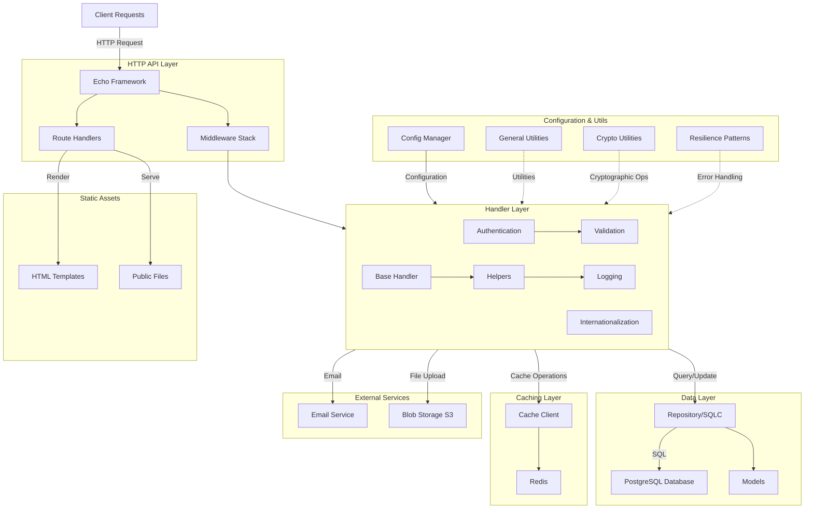

# Go API Starter - Architecture Overview

This document provides a high-level overview of the Go API starter project architecture.

## Architecture Diagram

## Project Structure

### Core Components

#### `/cmd`

- **app/main.go** - Application entry point, dependency initialization, server setup
- **devcerts/main.go** - Development certificate generation utility

#### `/handler`

- **handler.go** - HTTP request handler setup and route registration
- **auth.go** - Authentication-related handlers
- **base.go** - Base handler with common functionality
- **helpers.go** - Helper functions for handlers
- **handlerutil/** - Utility packages
  - **auth.go** - Authentication utilities
  - **i18n.go** - Internationalization
  - **validation.go** - Input validation
- **middleware/** - Echo middleware
  - **language.go** - Language detection
  - **logging.go** - Request logging
  - **path.go** - Path manipulation

#### `/database`

- **repository/** - SQLC generated database access layer
  - **db.go** - Database connection setup
  - **models.go** - Data models
  - **querier.go** - Query interface
  - **\*.sql.go** - Generated CRUD operations
- **queries/** - SQL query definitions
- **migrations/** - Database schema migrations
- **sqlc.yaml** - SQLC configuration

#### `/deps`

Dependency/service layer:

- **config/** - Configuration management via environment variables
- **postgres/** - PostgreSQL connection pooling
- **redis/** - Redis client setup
- **cache/** - Generic cache client (Redis-backed)
- **email/** - Email service client
- **blobstore/** - S3-compatible blob storage client

#### `/assets`

- **assets.go** - Asset embedding
- **public/** - Static files (images, CSS, JS)
- **templates/** - HTML templates
  - **emails/** - Email templates
  - **pages/** - Page templates

#### `/util`

- **crypto.go** - Cryptographic operations
- **general.go** - General utility functions
- **resilience.go** - Error handling and retry patterns
- **set.go** - Set data structure utilities

### Configuration & Deployment

- **go.mod** - Go module dependencies
- **taskfile.yaml** - Task automation (build, test, deploy)
- **deploy/compose/compose.dev.yaml** - Docker Compose dev environment
- **deploy/docker/Dockerfile** - Production Docker image

## Key Technologies

| Layer | Technology |
| ----- | ---------- |
| Web Framework | Echo v4 |
| Database | PostgreSQL with pgx |
| ORM/Query Builder | SQLC |
| Cache | Redis |
| Session Management | Gorilla Sessions |
| Monitoring | Prometheus, pprof |
| Storage | AWS S3 |
| Email | External Email Service |
| Configuration | Environment variables |
| Logging | slog (structured JSON) |

## Data Flow

1. **Request Reception**: Client request arrives at Echo router
2. **Middleware Processing**: Requests pass through middleware stack (logging, language, session)
3. **Handler Processing**: Route handler processes request, validates input
4. **Data Access**: Handler queries repository layer for database operations
5. **Caching**: Cache layer used for frequently accessed data (Redis)
6. **External Services**: Email and blob storage for specialized operations
7. **Response**: Handler renders template or returns JSON response

## Initialization Order (main.go)

1. Logger setup (slog with JSON handler)
2. Configuration loading from environment
3. PostgreSQL connection pool
4. Redis client initialization
5. Cache client setup
6. Email service client
7. Blob storage client
8. Repository (SQLC) initialization
9. Handler dependencies assembly
10. Echo server configuration and route registration
11. Server startup with graceful shutdown handling

## Design Patterns

- **Dependency Injection**: Dependencies passed through `Dependencies` struct to handlers
- **Handler Pattern**: All HTTP handlers implement Echo handler interface
- **Repository Pattern**: Database access abstracted through SQLC-generated repository
- **Middleware Pipeline**: Cross-cutting concerns handled via Echo middleware
- **Error Wrapping**: Errors wrapped with context using `fmt.Errorf`
- **Configuration Management**: 12-factor app principles with environment variables

## Session Management

- Uses Gorilla Sessions for session state
- Sessions stored in database via dedicated sessions table
- Session middleware automatically applied to routes

## Security Considerations

- CSRF protection through session tokens
- Input validation in handler utilities
- Cryptographic operations for sensitive data
- Environment-based secrets (no hardcoded credentials)
- HTTPS support with development certificate generation

## Scalability Features

- Connection pooling for PostgreSQL
- Redis caching for reduced database load
- Prometheus metrics exposure
- Structured logging for observability
- Graceful shutdown handling
